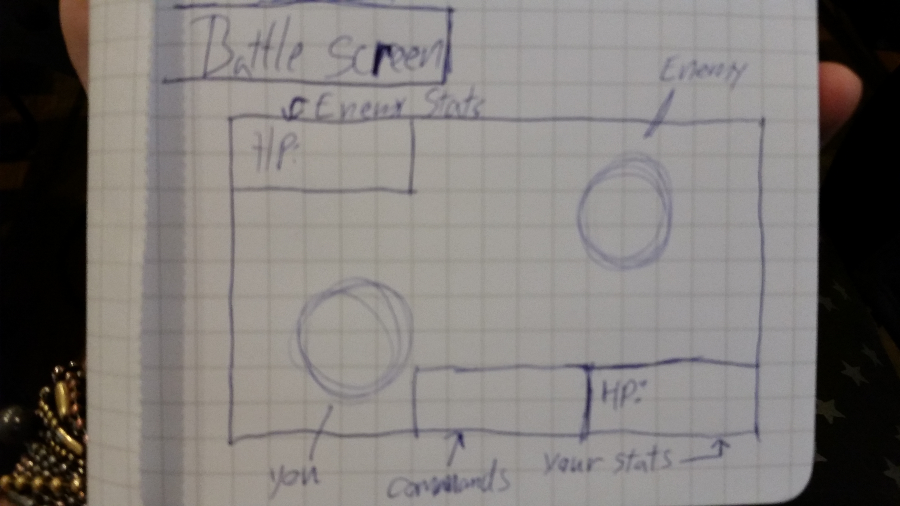
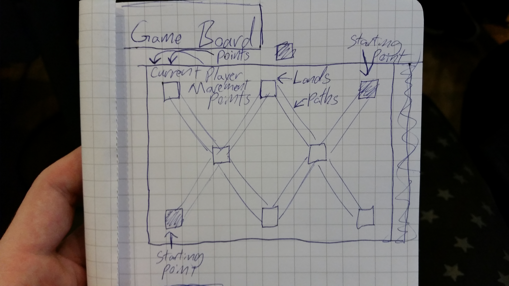

Become the Baddest Monster. Conquer the nearby lands and rule over more than your opponent to win!

Base User Stories:
* As a user, I will be able to pick a unique monster for the game
* As a user, I will be able to navigate to different points or 'lands' on a map to claim them
* As a user, I will battle random enemies in order to claim those 'lands'
* As a user, I will be able to battle the other player by attempting to claim the other players 'land'
* As a user, I will have a certain amount of movement points for navigating to 'lands'
* As a user, I will receive random benefits after claiming a land such an extra movement point, a (temporary?) stat increase, or teleportation to any 'land'

Bonus User Stories:
* As a user, I will be able to obtain unique features depending on the level and monster
* As a user, I will be able to level my monster up which increases it's stats
* As a user, I will be able to accrue gold from defeating monsters 
* As a user, I will be able to create buildings with gold to increment gold
* As a user, I will be able to create creatures (or other monsters) to protect their lands
* As a user, I will be able to change the way their monster looks by leveling it up
* As a user, I will be able to level up the creatures at their various land/town locations

Wire Frame:

